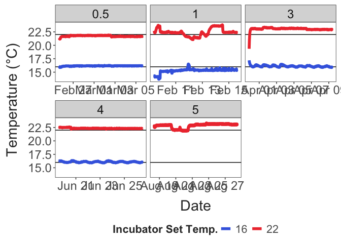
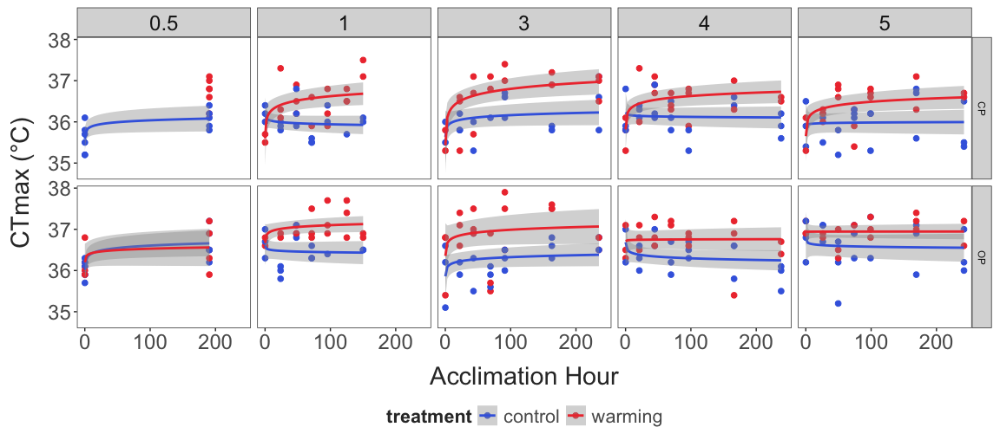
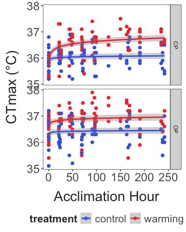
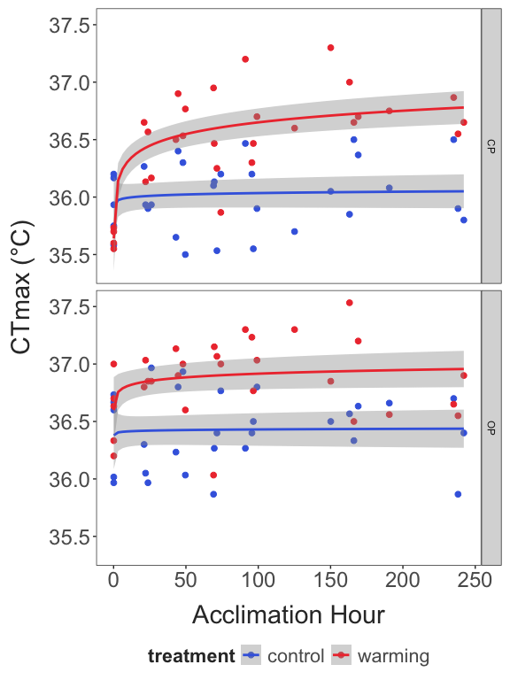
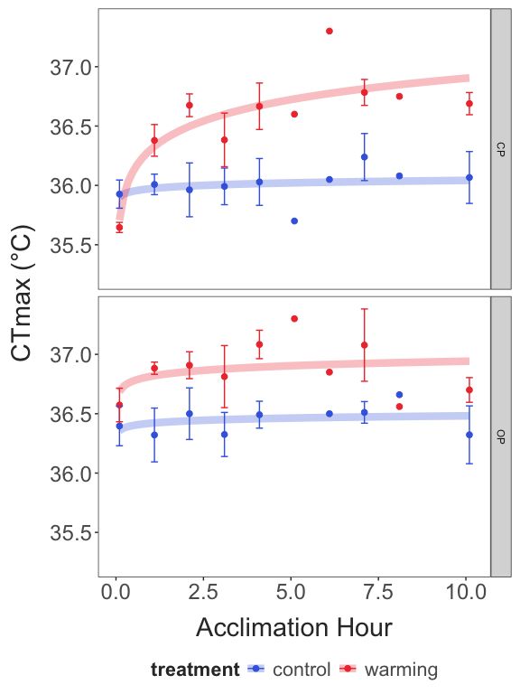
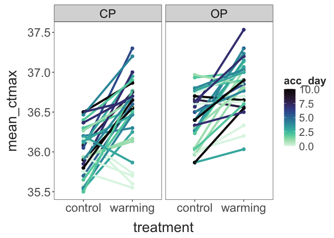
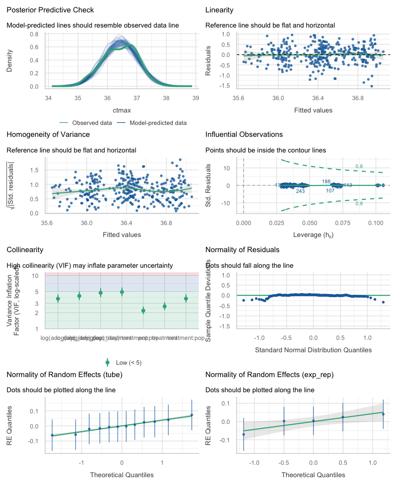
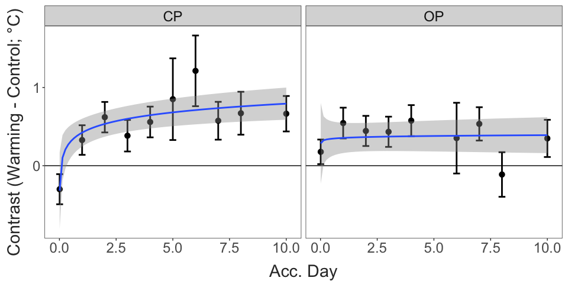
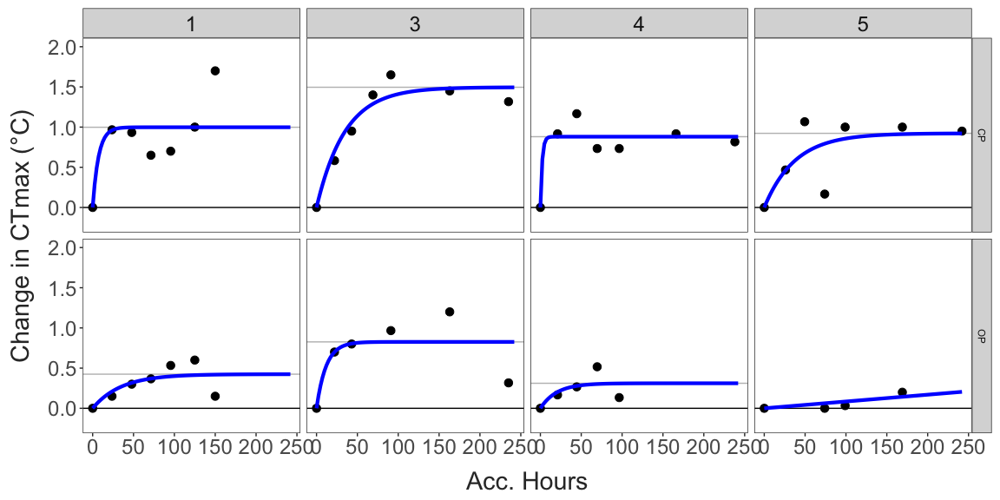
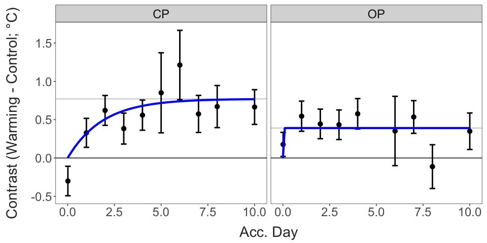

Intraspecific variation in the rate of acclimation in the widespread
copepod *Skistodiaptomus pallidus*
================
2026-09-04

- [Background](#background)
- [Results](#results)
  - [Incubator Temperatures](#incubator-temperatures)
  - [Data Summary](#data-summary)
  - [Linear Models and Contrasts](#linear-models-and-contrasts)
  - [Parameter estimation](#parameter-estimation)
- [Initial Conclusions](#initial-conclusions)
- [Still to do:](#still-to-do)

## Background

This project examines the rate and magnitude of acclimation in two
populations of *Skistodiaptomus pallidus*.

## Results

### Incubator Temperatures

``` r
acc_windows = ctmax_data %>% 
  group_by(exp_rep) %>% 
  summarise(start_time = min(datetime), 
            end_time = max(datetime)) 

filtered_temps = inc_temps %>% 
  mutate(exp_rep = if_else(exp_rep == 0, 0.5, exp_rep)) %>% 
  left_join(acc_windows, by = "exp_rep") %>% 
  filter(datetime > start_time & datetime < end_time) %>% 
  mutate("treatment" = if_else(incubator_temp == 16, "control", "warming")) %>% 
  select(exp_rep:temp_c, treatment)

exp_temps = filtered_temps %>%  
  group_by(exp_rep, treatment) %>% 
  summarise(mean_temp = mean(temp_c), 
            temp_sd = sd(temp_c)) %>% 
  select(exp_rep, treatment, mean_temp, temp_sd) |> 
  bind_rows(data.frame(exp_rep = 5, 
                       treatment = "control", ### Manually adding failed temperature log 
                       mean_temp = 16.3, ## Temperature recorded at the final timepoint
                       temp_sd = NA))

exp_temps %>% 
  pivot_wider(id_cols = c(exp_rep), 
              names_from = treatment, 
              values_from = mean_temp) %>%
  mutate(temp_diff = warming - control) %>% 
  knitr::kable(digits = 2)
```

| exp_rep | control | warming | temp_diff |
|--------:|--------:|--------:|----------:|
|     0.5 |   16.16 |   21.72 |      5.56 |
|     1.0 |   15.28 |   22.42 |      7.14 |
|     3.0 |   16.12 |   23.05 |      6.94 |
|     4.0 |   16.09 |   22.35 |      6.26 |
|     5.0 |   16.30 |   22.82 |      6.52 |

``` r

ggplot(filtered_temps, aes(x = datetime, y = temp_c, color = factor(incubator_temp))) + 
  facet_wrap(exp_rep~., scales = "free_x") + 
  geom_hline(yintercept = c(16, 22)) + 
  geom_line(linewidth = 2) + 
  scale_colour_manual(values = c("royalblue", "brown2")) + 
  labs(x = "Date", 
       y = "Temperature (°C)", 
       colour = "Incubator Set Temp.") + 
  theme_matt_facets() + 
  theme(legend.position = "bottom")
```



### Data Summary

All experimental data is shown below.

``` r
ctmax_data %>% 
  mutate(acc_hours = acc_hours + 0.1) %>% 
  ggplot(aes(x = acc_hours, y = ctmax, colour = treatment)) + 
  facet_grid(pop~exp_rep) +
  geom_point(size = 2) + 
  geom_smooth(method = "lm", formula = y ~ log(x)) + 
  scale_colour_manual(values = c("control" = "royalblue",
                                 "warming" = "brown2")) + 
  labs(x = "Acclimation Hour", 
       y = "CTmax (°C)") + 
  scale_x_continuous(breaks = c(0,100, 200)) + 
  theme_matt_facets() + 
  theme(legend.position = "bottom")
```



The experimental replicates are combined here.

``` r

ctmax_data %>% 
  mutate(acc_hours = acc_hours + 0.1) %>% 
  ggplot(aes(x = acc_hours, y = ctmax, colour = treatment)) + 
  facet_grid(pop~.) +
  geom_point(size = 2) + 
  geom_smooth(method = "lm", formula = y ~ log(x)) + 
  scale_colour_manual(values = c("control" = "royalblue",
                                 "warming" = "brown2")) + 
  labs(x = "Acclimation Hour", 
       y = "CTmax (°C)") + 
  theme_matt_facets() + 
  theme(legend.position = "bottom")
```



The plot above shows the raw data. The plot below shows daily averages
for each replicate.

``` r

ctmax_data %>% 
  mutate(acc_hours = acc_hours + 0.1) %>% 
  group_by(pop, treatment, exp_rep, acc_hours, acc_day) %>% 
  summarise(rep_ctmax = mean(ctmax)) %>% 
  ggplot(aes(x = acc_hours, y = rep_ctmax, colour = treatment)) + 
  facet_grid(pop~.) +
  geom_point(size = 2) + 
  geom_smooth(method = "lm", formula = y ~ log(x)) + 
  scale_colour_manual(values = c("control" = "royalblue",
                                 "warming" = "brown2")) + 
  labs(x = "Acclimation Hour", 
       y = "CTmax (°C)") + 
  theme_matt_facets() + 
  theme(legend.position = "bottom")
```



The plot below shows the overall average (average of the averages).
Error bars represent the standard error (calculated on the daily mean
CTmax values for the experimental replicates). Note, standard errors
cannot be calculated for days 5, 6, and 8, as CTmax was only measured on
these days during the initial replicate.

``` r

ctmax_data %>% 
  mutate(acc_hours = acc_hours + 0.1,
         acc_day = acc_day + 0.1) %>% 
  group_by(pop, treatment, exp_rep, acc_hours, acc_day) %>% 
  summarise(rep_ctmax = mean(ctmax)) %>% 
  ungroup() |> 
  group_by(pop, treatment, acc_day) |> 
  summarise(exp_ctmax = mean(rep_ctmax), 
            ctmax_se = sd(rep_ctmax)/ sqrt(n())) %>%
  ggplot(aes(x = acc_day, y = exp_ctmax, colour = treatment)) + 
  facet_grid(pop~.) +
    geom_line(stat = "smooth", method = "lm", formula = y ~ log(x), 
              alpha = 0.3, linewidth = 3) + 
  geom_point(size = 2) + 
  geom_errorbar(aes(ymin = exp_ctmax - ctmax_se, ymax = exp_ctmax + ctmax_se),
                width = 0.2) + 
  scale_colour_manual(values = c("control" = "royalblue",
                                 "warming" = "brown2")) + 
  labs(x = "Acclimation Hour", 
       y = "CTmax (°C)") + 
  theme_matt_facets() + 
  theme(legend.position = "bottom")
```



Shown below are the CTmax reaction norms for the two populations,
grouped by acclimation day and experimental replicate.

``` r

ctmax_data %>% 
  group_by(pop, treatment, acc_day, exp_rep) %>% 
  summarise(mean_ctmax = mean(ctmax, na.rm = T), 
            ctmax_se = sd(ctmax, na.rm = T)/sqrt(n())) %>% 
  mutate(group_id = paste(pop, exp_rep, acc_day)) %>% 
  ggplot(aes(x = treatment, y = mean_ctmax, colour = acc_day, group = group_id)) + 
  facet_grid(.~pop) + 
  geom_point(size = 2) + 
  geom_line(linewidth = 1.5) + 
  viridis::scale_color_viridis(option = "G", direction = -1) + 
  theme_matt_facets()
```



### Linear Models and Contrasts

We will be using a linear model to analyze the data: CTmax as a function
of treatment, population, and acclimation day (with all possible
interactions). We’ve also included random intercepts for the
experimental replicates and tube number (as a proxy for position in the
water bath).

``` r

model_data = ctmax_data %>%
  mutate(acc_hours = acc_hours + 0.1,
         acc_day = acc_day + 0.1, 
         exp_rep = as.factor(exp_rep)) 

mixed.model = lmer(ctmax ~ log(acc_day) * treatment * pop + 
                     (1 | exp_rep) + (1 | tube), 
                   data = model_data)
```

This model performs well.

``` r
performance::check_model(mixed.model)
```



The model indicates a significant effect of treatment and population. A
significant two way interaction between acclimation time and treatment
indicates that CTmax in the control and warming treatments change in
different ways (as expected). The significant three-way interaction
between acclimation time, treatment, and population indicates that the
different populations exhibit different acclimation dynamics (rate or
magnitude of acclimation).

``` r
#summary(mixed.model)

car::Anova(mixed.model, type = "III") 
## Analysis of Deviance Table (Type III Wald chisquare tests)
## 
## Response: ctmax
##                                 Chisq Df Pr(>Chisq)    
## (Intercept)                3.4563e+05  1  < 2.2e-16 ***
## log(acc_day)               2.2707e+00  1  0.1318374    
## treatment                  1.2499e+01  1  0.0004072 ***
## pop                        2.9656e+01  1  5.158e-08 ***
## log(acc_day):treatment     1.6935e+01  1  3.868e-05 ***
## log(acc_day):pop           1.7350e-01  1  0.6770073    
## treatment:pop              8.0990e-01  1  0.3681539    
## log(acc_day):treatment:pop 5.1976e+00  1  0.0226179 *  
## ---
## Signif. codes:  0 '***' 0.001 '**' 0.01 '*' 0.05 '.' 0.1 ' ' 1
```

To explore the significant three way interaction, we used the linear
model to calculate estimated marginal means for each
treatment-population combination on each day. We then calculate
contrasts between the control and warming treatment groups for each day.
A positive contrast indicates an increase in CTmax in the warming group
relative to the control group (i.e. an increase in thermal limits after
acclimation to higher temperatures) on that day.

These contrasts provide one potential approach for estimating the rate
and magnitude of acclimation capacities using the mathematical framework
proposed by Burton and Einum.

Below is a rough approximate of what that might look like, with a
logarithmic relationship shown between the effect of acclimation and the
acclimation duration.

``` r

cat_model_data = ctmax_data %>%
  mutate(acc_hours = as.factor(acc_hours), 
         acc_day = as.factor(acc_day), 
         exp_rep = as.factor(exp_rep))
  

cat_mixed.model = lmer(ctmax ~ acc_day * treatment * pop + 
                         (1 | exp_rep) + (1 | tube), 
                       data = cat_model_data)


contrasts = emmeans::emmeans(cat_mixed.model, ~ treatment | pop * acc_day) %>% 
  emmeans::contrast("revpairwise") %>% as_tibble() %>% 
  mutate(acc_day = as.numeric(as.character(acc_day)))

#write.csv(contrasts, file = "Output/Output_data/contrasts.csv", row.names = F)

contrasts %>% 
  mutate(acc_day = if_else(acc_day == 0, 0.01, acc_day)) %>% 
  ggplot(aes(x = acc_day, y = estimate)) + 
  facet_wrap(pop~.) + 
  geom_hline(yintercept = 0) +
  geom_errorbar(aes(ymin = estimate - SE, ymax = estimate + SE), 
                linewidth = 1, width = 0.3) + 
  geom_point(size = 3) + 
  geom_smooth(method = "lm", formula = y ~ log(x)) + 
  labs(x = "Acc. Day", 
       y = "Contrast (Warming - Control; °C)") + 
  theme_matt_facets()
```



### Parameter estimation

Burton and Einum (2025) describe an approach for measuring both rate of
acclimation and acclimation capacity from a time series of CTmax values.

Their approach relies on fitting the following model to the data:
$Z_t = Z_a * (1-e^{−λt})$

In this model, $Z_t$ is the effect of acclimation at time $t$. $Z_a$ is
the fully acclimated CTmax value (the asymptotic value, i.e. the
parameter representing magnitude of acclimation). The parameter $λ$ is
the rate of acclimation. In the Burton and Einum study, data sets had to
be transformed such that measurements at the different time points were
all relative to the first CTmax measurements (e.g. all time series start
at zero and measure the change relative to the start point).

We will take two approaches here: 1) estimating these parameters for
each experimental replicate (warming treatment only) to provide an
average rate and magnitude for each population, and 2) estimating these
parameters using the estimated contrasts from the linear mixed effects
model.

#### Approach 1 - Raw Data

``` r
# Zt = Za * (1-e^(−λt))
# Za is the rescaled asymptotic critical temperature when acclimation is complete (i.e., plasticity capacity)
# λ is the plasticity rate (per hour)

raw_param_data = ctmax_data %>%
  filter(treatment == "warming" & exp_rep != 0.5) %>% 
  mutate(acc_hours = if_else(acc_hours == 0, 0.01, acc_hours)) 

rep_params = data.frame()
rep_means = data.frame()

for (i in 1:length(unique(raw_param_data$pop))){
  
  pop_data = filter(raw_param_data, pop == unique(raw_param_data$pop)[i]) %>% 
    drop_na() 
  
  for(rep in unique(pop_data$exp_rep)){
    
    rep_control = filter(exp_temps, exp_rep == rep, treatment == "control")
    rep_warming = filter(exp_temps, exp_rep == rep, treatment == "warming")
    
    rep_data = filter(pop_data, exp_rep == rep) %>% 
      group_by(exp_rep, pop, acc_hours) %>%  
      summarise(ctmax = mean(ctmax)) %>% 
      ungroup() %>% 
      mutate(adj_ctmax = ctmax - first(ctmax)) %>% 
      filter(adj_ctmax >= 0)
    
    rep_means = bind_rows(rep_means, rep_data)
    
    mod1 = try(nls.multstart::nls_multstart(
      adj_ctmax ~ z_asymp*(1-exp(-lambda*acc_hours)),
      data = rep_data,
      iter = 1000,
      start_lower = c(z_asymp=0.01, lambda=0),
      start_upper = c(z_asymp = 10, lambda=1),
      lower = c(z_asymp = 0, lambda=0),
      supp_errors = 'Y',
      convergence_count = FALSE,
      na.action = na.omit), silent =TRUE)
    
    
    fit_error = (is(mod1, 'try-error')|is(mod1,'error')) 
    
    if(fit_error==F){   #if model converged
      params = data.frame(
        pop = rep_data$pop[1],
        exp_rep = rep,
        num_contrasts = length(rep_data$adj_ctmax),
        z_asymp = summary(mod1)$coefficients[1,1],
        z_asymp_var = vcov(mod1)[1,1],
        lambda = summary(mod1)$coefficients[2,1],
        lambda.var = vcov(mod1)[2,2]) %>% 
        mutate(temp_diff = rep_warming$mean_temp-rep_control$mean_temp, 
               arr = z_asymp / (rep_warming$mean_temp-rep_control$mean_temp))
      
      rep_params = bind_rows(rep_params, params)
    }
    
  }
  
}

if(dim(rep_params)[1] > 0){
  rep_params %>% 
    select(pop, exp_rep, n = num_contrasts, temp_diff, z_asymp, arr, lambda) %>% 
    knitr::kable()
}
```

| pop | exp_rep |   n | temp_diff |      z_asymp |         arr |    lambda |
|:----|--------:|----:|----------:|-------------:|------------:|----------:|
| CP  |       1 |   7 |  7.141744 |    0.9981064 |   0.1397567 | 0.1387654 |
| CP  |       3 |   7 |  6.935977 |    1.4958075 |   0.2156592 | 0.0286613 |
| CP  |       4 |   7 |  6.259351 |    0.8805599 |   0.1406791 | 0.4680296 |
| CP  |       5 |   7 |  6.518788 |    0.9225486 |   0.1415215 | 0.0265726 |
| OP  |       1 |   7 |  7.141744 |    0.4244840 |   0.0594370 | 0.0286941 |
| OP  |       3 |   6 |  6.935977 |    0.8262069 |   0.1191190 | 0.0853824 |
| OP  |       4 |   5 |  6.259351 |    0.3113551 |   0.0497424 | 0.0503000 |
| OP  |       5 |   4 |  6.518788 | 1008.3518605 | 154.6839585 | 0.0000008 |

The plot here shows the estimated contrasts on each day. The model fit
is included for both populations (in blue), along with the estimated
final magnitude of acclimation (grey horizontal line). Note that in Rep
5, parameter estimates for the OP population were outside of reasonable
estimates - the asymptote falls outside the plotted region.

``` r

rep_predictions = data.frame(
  pop = rep(rep_params$pop, each = 100), 
  exp_rep = rep(rep_params$exp_rep, each = 100), 
  z_asymp = rep(rep_params$z_asymp, each = 100), 
  lambda = rep(rep_params$lambda, each = 100),
  acc_hours = rep(seq(0, max(raw_param_data$acc_hours), length.out = 100)), times = dim(rep_params)[1]) %>% 
  ungroup() %>% 
  mutate(pred_ctmax = z_asymp * (1-exp(-lambda*acc_hours)))

rep_means %>% 
  filter(exp_rep != 0.5) %>% 
  ggplot(aes(x = acc_hours, y = adj_ctmax)) + 
  facet_grid(pop~exp_rep) + 
  geom_hline(yintercept = 0) +
  geom_hline(data = rep_params, aes(yintercept = z_asymp),
             colour = "grey") + 
  geom_point(size = 3) + 
  geom_line(data = rep_predictions, aes(x = acc_hours, y = pred_ctmax),
            colour = "blue",
            linewidth=1.5) + 
  coord_cartesian(ylim = c(-0.2, max(rep_means$adj_ctmax) + 0.3)) + 
  labs(x = "Acc. Hours", 
       y = "Change in CTmax (°C)") + 
  theme_matt_facets()
```



#### Approach 2 - Model Contrasts

The parameter estimates from the mixed effects model are shown below.

``` r
# Zt = Za * (1-e^(−λt))
# Za is the rescaled asymptotic critical temperature when acclimation is complete (i.e., plasticity capacity)
# λ is the plasticity rate (per hour)

param_data = contrasts %>%
  group_by(pop) %>% 
  arrange(acc_day) %>% 
  mutate(acc_day = if_else(acc_day == 0, 0.01, acc_day)) 

acc_params = data.frame()

for (i in 1:length(unique(param_data$pop))){
  
  pop_data = filter(param_data, pop == unique(param_data$pop)[i]) %>% 
    drop_na() 
  
  mod1 = try(nls.multstart::nls_multstart(
    estimate ~ z_asymp*(1-exp(-lambda*acc_day)),
    data = pop_data,
    iter = 1000,
    start_lower = c(z_asymp=0.01, lambda=0),
    start_upper = c(z_asymp = 10, lambda=1),
    lower = c(z_asymp = 0, lambda=0),
    supp_errors = 'Y',
    convergence_count = FALSE,
    na.action = na.omit), silent =TRUE)
  
  
  fit_error = (is(mod1, 'try-error')|is(mod1,'error')) 
  
  if(fit_error==F){   #if model converged
    pop_params = data.frame(
      z_asymp = summary(mod1)$coefficients[1,1],
      z_asymp_var = vcov(mod1)[1,1],
      lambda = summary(mod1)$coefficients[2,1],
      lambda.var = vcov(mod1)[2,2],
      pop = pop_data$pop[1],
      num_contrasts = length(pop_data$estimate)) %>% 
      mutate(arr = z_asymp / (22-16))
    
    acc_params = bind_rows(acc_params, pop_params)
  }
}

if(dim(acc_params)[1] > 0){
  acc_params %>% 
    select(pop, n = num_contrasts, z_asymp, arr, lambda) %>% 
    knitr::kable()
}
```

| pop |   n |   z_asymp |       arr |     lambda |
|:----|----:|----------:|----------:|-----------:|
| CP  |  10 | 0.7707470 | 0.1284578 |  0.5347791 |
| OP  |   9 | 0.3904633 | 0.0650772 | 60.4942666 |

``` r

#write.csv(acc_params, file = "Output/Output_data/acc_params.csv", row.names = F)
```

The plot here shows the estimated contrasts on each day. The model fit
is included for both populations (in blue), along with the estimated
final magnitude of acclimation (grey horizontal line).

``` r

if(dim(acc_params)[1] > 0){
  
  cp_params = filter(acc_params, pop == "CP")
  op_params = filter(acc_params, pop == "OP")
  
  # Create a new data frame with predicted values
  acc_day <- seq(0, max(param_data$acc_day), length.out = 100)
  cp_pred <- cp_params$z_asymp*(1-exp(-cp_params$lambda*acc_day))
  op_pred <- op_params$z_asymp*(1-exp(-op_params$lambda*acc_day))
  
  predictions = data.frame(acc_day, 
                           cp_pred, 
                           op_pred) %>% 
    pivot_longer(cols = c(cp_pred:op_pred), 
                 names_to = c("pop", NA), 
                 names_sep = "_", 
                 values_to = "pred") %>% 
    mutate(pop = toupper(pop))
  
  param_data %>% 
    ggplot(aes(x = acc_day, y = estimate)) + 
    facet_wrap(pop~.) + 
    geom_hline(yintercept = 0) +
    geom_hline(data = acc_params, aes(yintercept = z_asymp),
               colour = "grey") + 
    geom_errorbar(aes(ymin = estimate - SE, ymax = estimate + SE), 
                  linewidth = 1, width = 0.3) + 
    geom_point(size = 3) + 
    geom_line(data = predictions, aes(x = acc_day, y = pred),
              colour = "blue",
              linewidth=1.5)+
    labs(x = "Acc. Day", 
         y = "Contrast (Warming - Control; °C)") + 
    theme_matt_facets()
  
}
```



## Initial Conclusions

The three variables of interest are: CTmax (across all control
replicates; tests for differences between populations); rate of
acclimation (the lambda value); magnitude of acclimation (ARR values
from the parameter estimates).

Two different approaches were used to estimate these parameters, using
either the raw data adjusted in the manner proposed by Burton and Einum,
or using the daily contrasts from a linear mixed effects model. The raw
data approach failed to estimate reasonable parameters for one of the
experimental replicates (due to the late timing of a small observed
increase in CTmax in this replicate). Further, the raw data approach
does not take into account changes in CTmax in the control treatment,
which is particularly important given the relatively short generation
times of these copepods - the 10 day acclimation period we use
represents a significant portion of the generation time, and aging
affects may therefore have an influence during the later period of an
experiment. The linear mixed effects model accounts for this, along with
across-replicate variation, making this the preferred method for
estimating the parameters of interest.

## Still to do:

- Additional populations

- CHELSA environmental data analysis

- Comparison between control data (population divergence)
