<<<<<<< HEAD
------------------------------------------------------------------------

editor_options: markdown: wrap: 72 ---

# Rate of Acclimation in Skistodiaptomus pallidus

2026-06-28
=======
Rate of Acclimation in *Skistodiaptomus pallidus*
================
2026-08-11
>>>>>>> 863ae6b67db4903a2abab75fdd535a07ae84f51b

- [Background](#background)
- [Results](#results)
  - [Incubator Temperatures](#incubator-temperatures)
  - [Data Summary](#data-summary)
  - [Linear Models and Contrasts](#linear-models-and-contrasts)
  - [Parameter estimation](#parameter-estimation)
- [Initial Conclusions](#initial-conclusions)
- [Preliminary Trials](#preliminary-trials)
  - [Before-and-After Acclimation](#before-and-after-acclimation)
  - [Daily Measurements](#daily-measurements)

## Background

<<<<<<< HEAD
This project examines the rate and magnitude of acclimation in two populations of *Skistodiaptomus pallidus*. The preliminary trials described below establish key elements of the experimental design and protocol. Note: Trials are presented in a logical, not chronological, order - Preliminary Trial B was performed before Trial A.

## Preliminary Trials {#preliminary-trials}

### Before-and-After Acclimation {#before-and-after-acclimation}

This trial examined the “maximum” amount of acclimation we can reasonably expect to measure in a feasible amount of time. Experiment duration is limited by factors like the generation time of copepods - long experiments risk conflating individual age and acclimation effects. Incubator temperatures were stable during this trial, tracked continuously using a HOBO logger submerged in similar amounts of water as used to maintain the copepods during acclimation.

``` r
acc_windows = ctmax_data %>% 
  group_by(exp_rep) %>% 
  summarise(start_time = min(datetime), 
            end_time = max(datetime)) %>% 
  filter(exp_rep == 0.5)

# To do: figure out a way to filter the data based on the acc_windows object; each exp_rep has a separate start and end time that should be used
inc_temps %>% 
  filter(datetime > acc_windows$start_time & datetime < acc_windows$end_time) %>%  
  group_by(incubator_temp) %>% 
  summarise(mean_temp = mean(temp_c), 
            temp_sd = sd(temp_c)) %>% 
  knitr::kable(digits = 2)
```

| incubator_temp | mean_temp | temp_sd |
|---------------:|----------:|--------:|
|             16 |     16.16 |    0.05 |
|             22 |     21.72 |    0.11 |

``` r

# Eventually will want to convert datetime into 'time since start' or something like that so all the reps can be overlaid
inc_temps %>% 
  filter(datetime > acc_windows$start_time & datetime < acc_windows$end_time) %>%  
  mutate(inc_id = paste(exp_rep, incubator_id, sep = "_")) %>% 
  ggplot(aes(x = datetime, y = temp_c, colour = factor(incubator_temp), group = inc_id)) + 
  geom_hline(yintercept = c(16,22)) + 
  geom_line(linewidth = 2) + 
  scale_colour_manual(values = c("royalblue", "brown2")) + 
  labs(y = "Temperature (°C)", 
       x = "Date", 
       colour = "Incubator \nTemp. (°C)") + 
  theme_bw(base_size = 25) + 
  theme(panel.grid = element_blank())
```

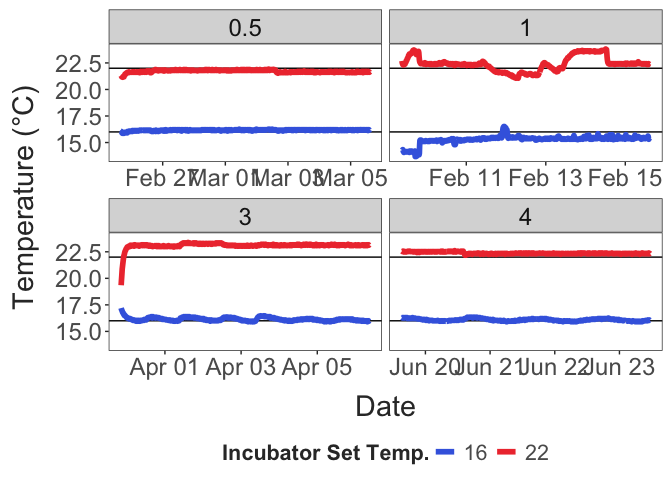

CTmax was measured before acclimation began and after 8 days of acclimation. Here is a quick check to make sure there’s no systematic differences between observers. Measurements for the four groups are shown for each acclimation day. The different water baths (i.e. the different observers) are shown in different colors.

``` r

ctmax_data %>%  
  filter(exp_rep == 0.5) %>% 
  mutate(water_bath = as.factor(water_bath), 
         acc_day = as.factor(acc_day)) %>% 
  ggplot(aes(x = acc_day, y = ctmax, colour = water_bath)) + 
  facet_wrap(pop~treatment) +
  geom_point() + 
  theme_matt_facets()
```

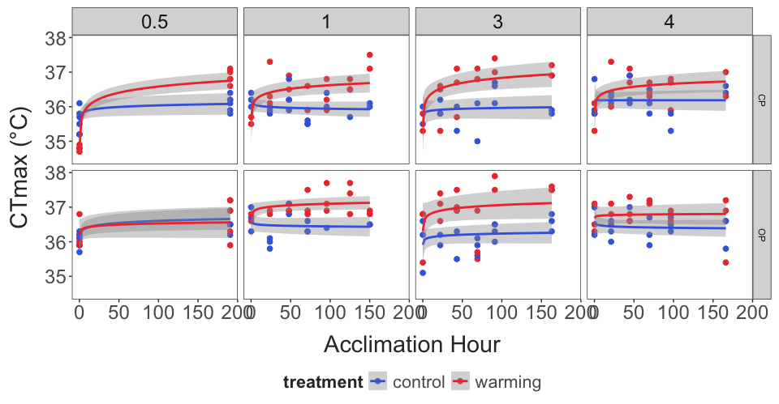

The change in CTmax over time for each of the four groups is shown below. There was a general increase in CTmax over time (increases in the control groups), but above this background change there was a pronounced increase in the CTmax for the Centennial Park warming group.

``` r
ctmax_data %>%  
  filter(exp_rep == 0.5) %>% 
  group_by(pop, treatment, acc_day) %>% 
  summarise(mean_ctmax = mean(ctmax, na.rm = T), 
            ctmax_se = sd(ctmax) / sqrt(n())) %>% 
  ggplot(aes(x = acc_day, y = mean_ctmax, colour = treatment, group = treatment)) + 
  facet_wrap(pop~.) + 
  geom_point(size = 4) + 
  geom_line(linewidth = 2) + 
  geom_errorbar(aes(ymin = mean_ctmax - ctmax_se, 
                    ymax = mean_ctmax + ctmax_se), 
                linewidth = 2, width = 1) + 
  scale_colour_manual(values = c("royalblue", "brown2")) + 
  scale_x_continuous(breaks = c(0,8)) + 
  theme_matt()
```

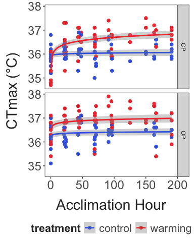

### Daily Measurements {#daily-measurements}

In the other preliminary trial, the temperatures were more variable. Averages and standard deviations from the two incubators are shown in this table. This may have due to fluctuations in ambient room temperature and/or because temperature loggers were measuring air, and not water, temperatures during this trial.

``` r
acc_windows = ctmax_data %>% 
  group_by(exp_rep) %>% 
  summarise(start_time = min(datetime), 
            end_time = max(datetime)) %>% 
  filter(exp_rep == 1)

# To do: figure out a way to filter the data based on the acc_windows object; each exp_rep has a separate start and end time that should be used
inc_temps %>% 
  filter(datetime > acc_windows$start_time & datetime < acc_windows$end_time) %>%  
  group_by(incubator_temp) %>% 
  summarise(mean_temp = mean(temp_c), 
            temp_sd = sd(temp_c)) %>% 
  knitr::kable(digits = 2)
```

| incubator_temp | mean_temp | temp_sd |
|---------------:|----------:|--------:|
|             16 |     15.28 |    0.39 |
|             22 |     22.42 |    0.68 |

While the average temperature was closer to the intended temperature in the 22°C incubator, temperature was more variable than in the 16°C incubator.

``` r

# Eventually will want to convert datetime into 'time since start' or something like that so all the reps can be overlaid
inc_temps %>% 
  filter(datetime > acc_windows$start_time & datetime < acc_windows$end_time) %>%  
  mutate(inc_id = paste(exp_rep, incubator_id, sep = "_")) %>% 
  ggplot(aes(x = datetime, y = temp_c, colour = factor(incubator_temp), group = inc_id)) + 
  geom_hline(yintercept = c(16,22)) + 
  geom_line(linewidth = 2) + 
  scale_colour_manual(values = c("royalblue", "brown2")) + 
  labs(y = "Temperature (°C)", 
       x = "Date", 
       colour = "Incubator \nTemp. (°C)") + 
  theme_bw(base_size = 25) + 
  theme(panel.grid = element_blank())
```

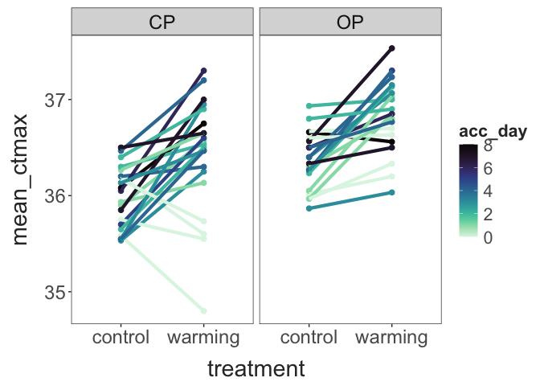

Thermal limit data is shown below. The larger points indicate the mean for each treatment group on each acclimation day, with the raw data shown as lighter points in the background. A general trend of increasing thermal limits in the warming acclimation group is present, but there is a fair amount of variation. That being said, it is too early to make any conclusions about specific patterns.

``` r
ctmax_data %>% 
  filter(exp_rep == 1) %>% 
  group_by(pop, treatment, acc_hours) %>% 
  summarise(mean_ctmax = mean(ctmax)) %>% 
  ggplot(aes(x = acc_hours, y = mean_ctmax, colour = treatment)) + 
  facet_wrap(pop~.) + 
  geom_point(data = filter(ctmax_data, exp_rep == 1), aes(y = ctmax),
             alpha = 0.3) + 
  geom_point(size = 3) + 
  geom_line(linewidth = 1.5) + 
  scale_colour_manual(values = c("control" = "royalblue",
                                 "warming" = "brown2")) + 
  labs(x = "Acclimation Hour", 
       y = "CTmax (°C)") + 
  theme_matt_facets()
```

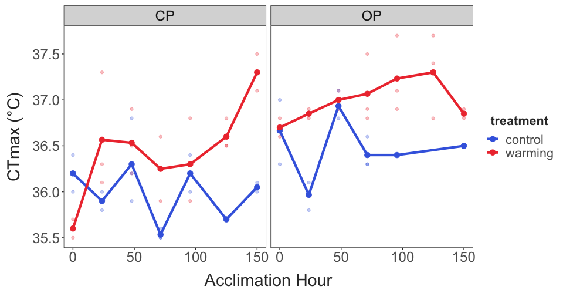

Shown below are the reaction norms for the two populations based on the first and last measurements made (Day 6 in the daily measurements trial and Day 8 in the before-and-after acclimation trial). Results are similar for both populations, suggesting that an eight day period is sufficient for the effects of acclimation to plateau.

``` r
ctmax_data %>%  
  group_by(exp_rep) %>% 
  filter(acc_hours == max(acc_hours)) %>% 
  group_by(exp_rep, pop, treatment, acc_hours) %>% 
  summarise(mean_ctmax = mean(ctmax, na.rm = T), 
            ctmax_se = sd(ctmax) / sqrt(n())) %>% 
  ggplot(aes(x = treatment, y = mean_ctmax, colour = pop, group = exp_rep)) + 
  facet_wrap(pop~.) + 
  geom_point(size = 4, 
             position = position_dodge(width = 0.5)) + 
  geom_line(linewidth = 2, 
            position = position_dodge(width = 0.5)) + 
  geom_errorbar(aes(ymin = mean_ctmax - ctmax_se, 
                    ymax = mean_ctmax + ctmax_se), 
                linewidth = 2, width = 0.2, 
                position = position_dodge(width = 0.5)) + 
  theme_matt()
```

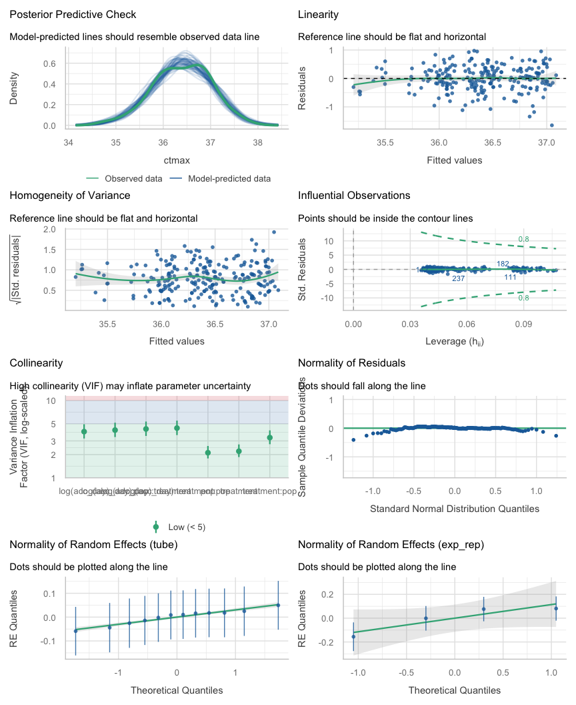

## Running Analyses {#running-analyses}
=======
This project examines the rate and magnitude of acclimation in two
populations of *Skistodiaptomus pallidus*.

## Results
>>>>>>> 863ae6b67db4903a2abab75fdd535a07ae84f51b

### Incubator Temperatures {#incubator-temperatures}

``` r
acc_windows = ctmax_data %>% 
  group_by(exp_rep) %>% 
  summarise(start_time = min(datetime), 
            end_time = max(datetime)) 

filtered_temps = inc_temps %>% 
  mutate(exp_rep = if_else(exp_rep == 0, 0.5, exp_rep)) %>% 
  left_join(acc_windows, by = "exp_rep") %>% 
  filter(datetime > start_time & datetime < end_time) %>% 
  mutate("treatment" = if_else(incubator_temp == 16, "control", "warming")) %>% 
  select(exp_rep:temp_c, treatment)

exp_temps = filtered_temps %>%  
  group_by(exp_rep, treatment) %>% 
  summarise(mean_temp = mean(temp_c), 
            temp_sd = sd(temp_c)) %>% 
  select(exp_rep, treatment, mean_temp, temp_sd) 

exp_temps %>% 
  pivot_wider(id_cols = c(exp_rep), 
              names_from = treatment, 
              values_from = mean_temp) %>%
  mutate(temp_diff = warming - control) %>% 
  knitr::kable(digits = 2)
```

| exp_rep | control | warming | temp_diff |
|--------:|--------:|--------:|----------:|
|     0.5 |   16.16 |   21.72 |      5.56 |
|     1.0 |   15.28 |   22.42 |      7.14 |
<<<<<<< HEAD
|     3.0 |   16.12 |   23.05 |      6.94 |
|     4.0 |   16.09 |   22.35 |      6.26 |
=======
|     3.0 |   16.15 |   23.10 |      6.96 |
|     4.0 |   16.09 |   22.38 |      6.29 |
>>>>>>> 863ae6b67db4903a2abab75fdd535a07ae84f51b

``` r

ggplot(filtered_temps, aes(x = datetime, y = temp_c, color = factor(incubator_temp))) + 
  facet_wrap(exp_rep~., scales = "free_x") + 
  geom_hline(yintercept = c(16, 22)) + 
  geom_line(linewidth = 2) + 
  scale_colour_manual(values = c("royalblue", "brown2")) + 
  labs(x = "Date", 
       y = "Temperature (°C)", 
       colour = "Incubator Set Temp.") + 
  theme_matt_facets() + 
  theme(legend.position = "bottom")
```

<<<<<<< HEAD
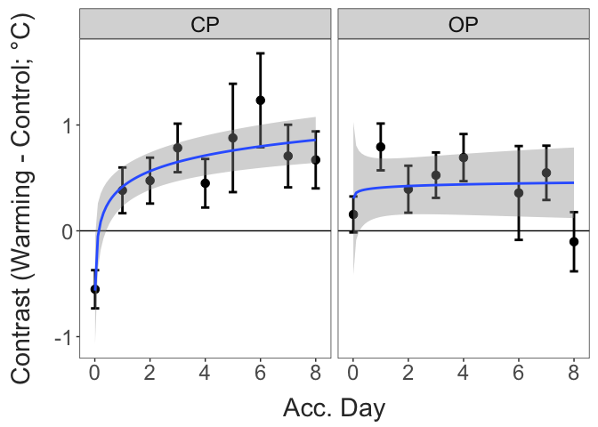
=======

>>>>>>> 863ae6b67db4903a2abab75fdd535a07ae84f51b

### Data Summary {#data-summary}

All experimental data is shown below.

``` r
ctmax_data %>% 
  mutate(acc_hours = acc_hours + 0.1) %>% 
  ggplot(aes(x = acc_hours, y = ctmax, colour = treatment)) + 
  facet_grid(pop~exp_rep) +
  geom_point(size = 2) + 
  geom_smooth(method = "lm", formula = y ~ log(x)) + 
  scale_colour_manual(values = c("control" = "royalblue",
                                 "warming" = "brown2")) + 
  labs(x = "Acclimation Hour", 
       y = "CTmax (°C)") + 
  theme_matt_facets() + 
  theme(legend.position = "bottom")
```

<<<<<<< HEAD
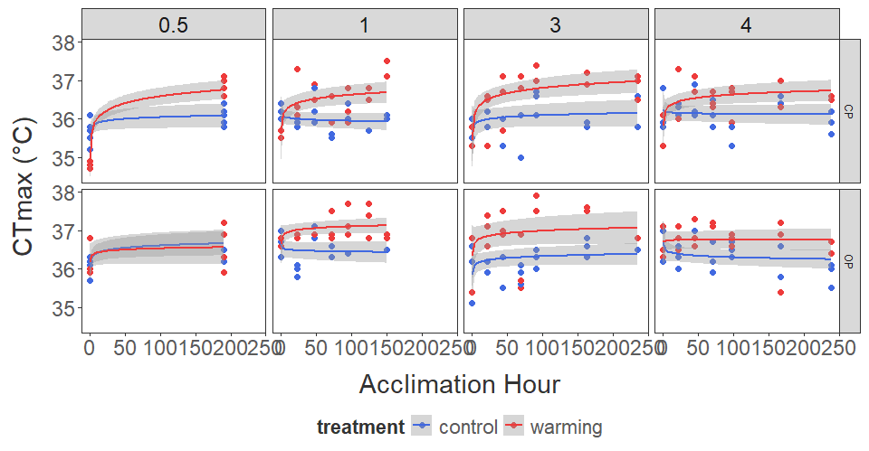
=======

>>>>>>> 863ae6b67db4903a2abab75fdd535a07ae84f51b

The experimental replicates are combined here.

``` r

ctmax_data %>% 
  mutate(acc_hours = acc_hours + 0.1) %>% 
  ggplot(aes(x = acc_hours, y = ctmax, colour = treatment)) + 
  facet_grid(pop~.) +
  geom_point(size = 2) + 
  geom_smooth(method = "lm", formula = y ~ log(x)) + 
  scale_colour_manual(values = c("control" = "royalblue",
                                 "warming" = "brown2")) + 
  labs(x = "Acclimation Hour", 
       y = "CTmax (°C)") + 
  theme_matt_facets() + 
  theme(legend.position = "bottom")
```

<<<<<<< HEAD
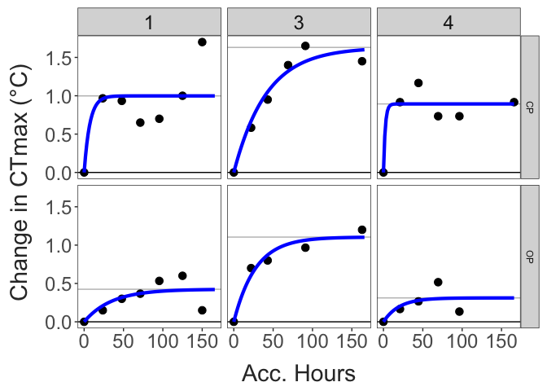
=======


The plot above shows the raw data. The plot below shows daily averages
for each replicate.

``` r

ctmax_data %>% 
  mutate(acc_hours = acc_hours + 0.1) %>% 
  group_by(pop, treatment, exp_rep, acc_hours, acc_day) %>% 
  summarise(rep_ctmax = mean(ctmax)) %>% 
  ggplot(aes(x = acc_hours, y = rep_ctmax, colour = treatment)) + 
  facet_grid(pop~.) +
  geom_point(size = 2) + 
  geom_smooth(method = "lm", formula = y ~ log(x)) + 
  scale_colour_manual(values = c("control" = "royalblue",
                                 "warming" = "brown2")) + 
  labs(x = "Acclimation Hour", 
       y = "CTmax (°C)") + 
  theme_matt_facets() + 
  theme(legend.position = "bottom")
```

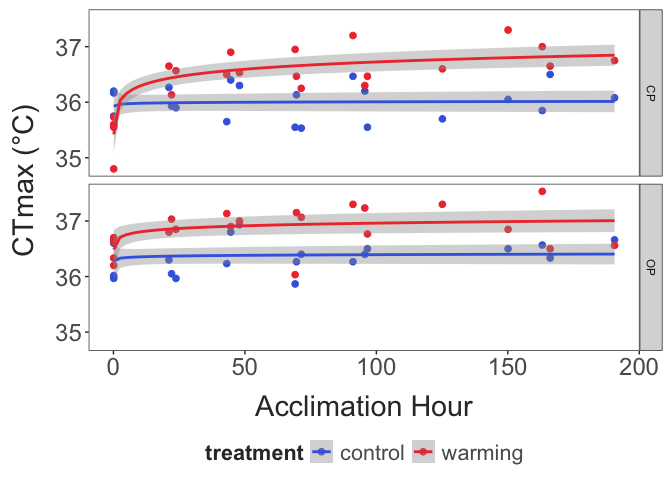

Shown below are the CTmax reaction norms for the two populations,
grouped by acclimation day and experimental replicate.

``` r

ctmax_data %>% 
  group_by(pop, treatment, acc_day, exp_rep) %>% 
  summarise(mean_ctmax = mean(ctmax, na.rm = T), 
            ctmax_se = sd(ctmax, na.rm = T)/sqrt(n())) %>% 
  mutate(group_id = paste(pop, exp_rep, acc_day)) %>% 
  ggplot(aes(x = treatment, y = mean_ctmax, colour = acc_day, group = group_id)) + 
  facet_grid(.~pop) + 
  geom_point(size = 2) + 
  geom_line(linewidth = 1.5) + 
  viridis::scale_color_viridis(option = "G", direction = -1) + 
  theme_matt_facets()
```


>>>>>>> 863ae6b67db4903a2abab75fdd535a07ae84f51b

### Linear Models and Contrasts {#linear-models-and-contrasts}

We will be using a linear model to analyze the data: CTmax as a function of treatment, population, and acclimation day (with all possible interactions). We’ve also included random intercepts for the experimental replicates and tube number (as a proxy for position in the water bath).

``` r

model_data = ctmax_data %>%
  mutate(acc_hours = acc_hours + 0.1,
         acc_day = acc_day + 0.1, 
         exp_rep = as.factor(exp_rep)) 

mixed.model = lmer(ctmax ~ log(acc_day) * treatment * pop + 
                     (1 | exp_rep) + (1 | tube), 
                   data = model_data)
```

This model performs well.

``` r
performance::check_model(mixed.model)
```

<<<<<<< HEAD
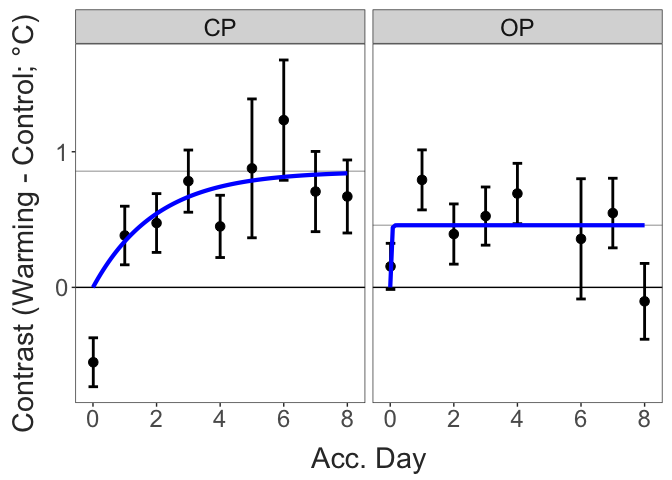
=======

>>>>>>> 863ae6b67db4903a2abab75fdd535a07ae84f51b

The model indicates a significant effect of treatment and population, along with a significant interaction between acclimation time and treatment.

``` r
#summary(mixed.model)

car::Anova(mixed.model, type = "III") 
## Analysis of Deviance Table (Type III Wald chisquare tests)
## 
## Response: ctmax
##                                 Chisq Df Pr(>Chisq)    
<<<<<<< HEAD
## (Intercept)                2.3202e+05  1  < 2.2e-16 ***
## log(acc_day)               4.2600e-02  1   0.836542    
## treatment                  6.9528e+00  1   0.008369 ** 
## pop                        1.0144e+01  1   0.001447 ** 
## log(acc_day):treatment     1.5205e+01  1  9.645e-05 ***
## log(acc_day):pop           1.7200e-02  1   0.895751    
## treatment:pop              1.8734e+00  1   0.171089    
## log(acc_day):treatment:pop 3.5032e+00  1   0.061249 .  
=======
## (Intercept)                1.6875e+05  1  < 2.2e-16 ***
## log(acc_day)               1.1374e+00  1   0.286205    
## treatment                  6.7325e+00  1   0.009467 ** 
## pop                        1.7089e+01  1  3.567e-05 ***
## log(acc_day):treatment     3.1039e+01  1  2.529e-08 ***
## log(acc_day):pop           2.7200e-02  1   0.868985    
## treatment:pop              2.6008e+00  1   0.106813    
## log(acc_day):treatment:pop 1.0151e+01  1   0.001442 ** 
>>>>>>> 863ae6b67db4903a2abab75fdd535a07ae84f51b
## ---
## Signif. codes:  0 '***' 0.001 '**' 0.01 '*' 0.05 '.' 0.1 ' ' 1
```

We can also use linear models to calculate estimated marginal means for each treatment-population combination on each day. We then calculate contrasts between the control and warming treatment groups for each day. A positive contrast indicates an increase in CTmax in the warming group relative to the control group (i.e. an increase in thermal limits after acclimation to higher temperatures).

These contrasts provide one potential approach for estimating the rate and magnitude of acclimation capacities using the mathematical framework proposed by Burton and Einum.

Below is a rough approximate of what that might look like, with a logarithmic relationship shown between the effect of acclimation and the acclimation duration.

``` r

cat_model_data = ctmax_data %>%
  mutate(acc_hours = as.factor(acc_hours), 
         acc_day = as.factor(acc_day), 
         exp_rep = as.factor(exp_rep))
  

cat_mixed.model = lmer(ctmax ~ acc_day * treatment * pop + 
                         (1 | exp_rep) + (1 | tube), 
                       data = cat_model_data)


contrasts = emmeans::emmeans(cat_mixed.model, ~ treatment | pop * acc_day) %>% 
  emmeans::contrast("revpairwise") %>% as_tibble() %>% 
  mutate(acc_day = as.numeric(as.character(acc_day)))

contrasts %>% 
  mutate(acc_day = if_else(acc_day == 0, 0.01, acc_day)) %>% 
  ggplot(aes(x = acc_day, y = estimate)) + 
  facet_wrap(pop~.) + 
  geom_hline(yintercept = 0) +
  geom_errorbar(aes(ymin = estimate - SE, ymax = estimate + SE), 
                linewidth = 1, width = 0.3) + 
  geom_point(size = 3) + 
  geom_smooth(method = "lm", formula = y ~ log(x)) + 
  labs(x = "Acc. Day", 
       y = "Contrast (Warming - Control; °C)") + 
  theme_matt_facets()
```

<<<<<<< HEAD
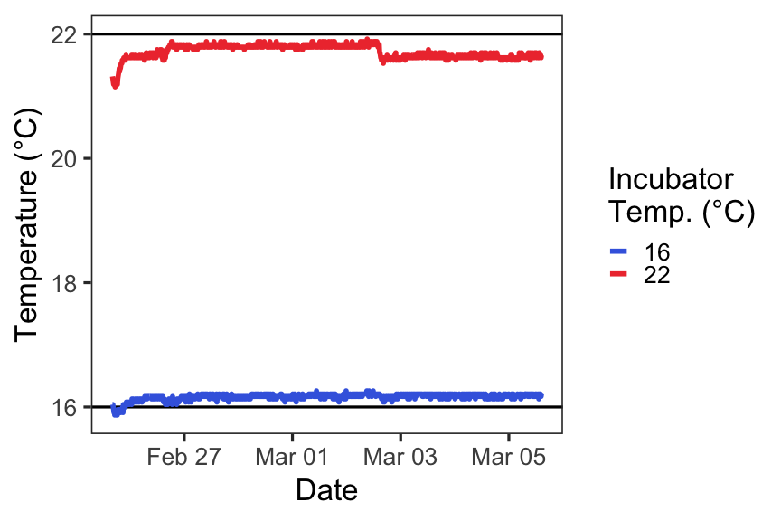
=======

>>>>>>> 863ae6b67db4903a2abab75fdd535a07ae84f51b

### Parameter estimation {#parameter-estimation}

Burton and Einum (2025) describe an approach for measuring both rate of acclimation and acclimation capacity from a time series of CTmax values.

Their approach relies on fitting the following model to the data: Zt = Za \* (1-e\^(−λt))

In this model, Zt is the effect of acclimation at time t. Za is the fully acclimated CTmax value (the asymptotic value, i.e. the parameter representing magnitude of acclimation). The parameter λ is the rate of acclimation. In the Burton and Einum study, data sets had to be transformed such that measurements at the different time points were all relative to the first CTmax measurements (e.g. all time series start at zero and measure the change relative to the start point).

We will take two approaches here: 1) estimating these parameters for each experimental replicate (warming treatment only) to provide an average rate and magnitude for each population, and 2) estimating these parameters using the estimated contrasts from the linear mixed effects model.

#### Approach 1 - Raw Data

``` r
# Zt = Za * (1-e^(−λt))
# Za is the rescaled asymptotic critical temperature when acclimation is complete (i.e., plasticity capacity)
# λ is the plasticity rate (per hour)

raw_param_data = ctmax_data %>%
  filter(treatment == "warming" & exp_rep != 0.5) %>% 
  mutate(acc_hours = if_else(acc_hours == 0, 0.01, acc_hours)) 

rep_params = data.frame()
rep_means = data.frame()

for (i in 1:length(unique(raw_param_data$pop))){
  
  pop_data = filter(raw_param_data, pop == unique(raw_param_data$pop)[i]) %>% 
    drop_na() 
  
  for(rep in unique(pop_data$exp_rep)){
    
    rep_control = filter(exp_temps, exp_rep == rep, treatment == "control")
    rep_warming = filter(exp_temps, exp_rep == rep, treatment == "warming")
    
    rep_data = filter(pop_data, exp_rep == rep) %>% 
      group_by(exp_rep, pop, acc_hours) %>%  
      summarise(ctmax = mean(ctmax)) %>% 
      ungroup() %>% 
      mutate(adj_ctmax = ctmax - first(ctmax)) %>% 
      filter(adj_ctmax >= 0)
    
    rep_means = bind_rows(rep_means, rep_data)
    
    mod1 = try(nls.multstart::nls_multstart(
      adj_ctmax ~ z_asymp*(1-exp(-lambda*acc_hours)),
      data = rep_data,
      iter = 1000,
      start_lower = c(z_asymp=0.01, lambda=0),
      start_upper = c(z_asymp = 10, lambda=1),
      lower = c(z_asymp = 0, lambda=0),
      supp_errors = 'Y',
      convergence_count = FALSE,
      na.action = na.omit), silent =TRUE)
    
    
    fit_error = (is(mod1, 'try-error')|is(mod1,'error')) 
    
    if(fit_error==F){   #if model converged
      params = data.frame(
        pop = rep_data$pop[1],
        exp_rep = rep,
        num_contrasts = length(rep_data$adj_ctmax),
        z_asymp = summary(mod1)$coefficients[1,1],
        z_asymp_var = vcov(mod1)[1,1],
        lambda = summary(mod1)$coefficients[2,1],
        lambda.var = vcov(mod1)[2,2]) %>% 
        mutate(temp_diff = rep_warming$mean_temp-rep_control$mean_temp, 
               arr = z_asymp / (rep_warming$mean_temp-rep_control$mean_temp))
      
      rep_params = bind_rows(rep_params, params)
    }
    
  }
  
}

if(dim(rep_params)[1] > 0){
  rep_params %>% 
    select(pop, exp_rep, n = num_contrasts, temp_diff, z_asymp, arr, lambda) %>% 
    knitr::kable()
}
```

| pop | exp_rep |   n | temp_diff |   z_asymp |       arr |    lambda |
|:----|--------:|----:|----------:|----------:|----------:|----------:|
<<<<<<< HEAD
| CP  |       1 |   7 |  7.141744 | 0.9981064 | 0.1397567 | 0.1387654 |
| CP  |       3 |   7 |  6.935977 | 1.4958075 | 0.2156592 | 0.0286613 |
| CP  |       4 |   7 |  6.259351 | 0.8805599 | 0.1406791 | 0.4680296 |
| OP  |       1 |   7 |  7.141744 | 0.4244840 | 0.0594370 | 0.0286941 |
| OP  |       3 |   6 |  6.935977 | 0.8262069 | 0.1191190 | 0.0853824 |
| OP  |       4 |   5 |  6.259351 | 0.3113551 | 0.0497424 | 0.0503000 |
=======
| CP  |       1 |   7 |  7.141744 | 0.9981064 | 0.1397567 | 0.1387655 |
| CP  |       3 |   6 |  6.955106 | 1.6305624 | 0.2344411 | 0.0240204 |
| CP  |       4 |   6 |  6.290433 | 0.8933438 | 0.1420163 | 0.4486355 |
| OP  |       1 |   7 |  7.141744 | 0.4244840 | 0.0594370 | 0.0286941 |
| OP  |       3 |   5 |  6.955106 | 1.1046977 | 0.1588326 | 0.0361605 |
| OP  |       4 |   5 |  6.290433 | 0.3113551 | 0.0494966 | 0.0503000 |
>>>>>>> 863ae6b67db4903a2abab75fdd535a07ae84f51b

The plot here shows the estimated contrasts on each day. The model fit is included for both populations (in blue), along with the estimated final magnitude of acclimation (grey horizontal line).

``` r

rep_predictions = data.frame(
  pop = rep(rep_params$pop, each = 100), 
  exp_rep = rep(rep_params$exp_rep, each = 100), 
  z_asymp = rep(rep_params$z_asymp, each = 100), 
  lambda = rep(rep_params$lambda, each = 100),
  acc_hours = rep(seq(0, max(raw_param_data$acc_hours), length.out = 100)), times = dim(rep_params)[1]) %>% 
  ungroup() %>% 
  mutate(pred_ctmax = z_asymp * (1-exp(-lambda*acc_hours)))

rep_means %>% 
  filter(exp_rep != 0.5) %>% 
  ggplot(aes(x = acc_hours, y = adj_ctmax)) + 
  facet_grid(pop~exp_rep) + 
  geom_hline(yintercept = 0) +
  geom_hline(data = rep_params, aes(yintercept = z_asymp),
             colour = "grey") + 
  geom_point(size = 3) + 
  geom_line(data = rep_predictions, aes(x = acc_hours, y = pred_ctmax),
            colour = "blue",
            linewidth=1.5) + 
  labs(x = "Acc. Hours", 
       y = "Change in CTmax (°C)") + 
  theme_matt_facets()
```

<<<<<<< HEAD

=======

>>>>>>> 863ae6b67db4903a2abab75fdd535a07ae84f51b

#### Approach 2 - Model Contrasts

The parameter estimates from the mixed effects model are shown below.

``` r
# Zt = Za * (1-e^(−λt))
# Za is the rescaled asymptotic critical temperature when acclimation is complete (i.e., plasticity capacity)
# λ is the plasticity rate (per hour)

param_data = contrasts %>%
  group_by(pop) %>% 
  arrange(acc_day) %>% 
  mutate(acc_day = if_else(acc_day == 0, 0.01, acc_day)) 

acc_params = data.frame()

for (i in 1:length(unique(param_data$pop))){
  
  pop_data = filter(param_data, pop == unique(param_data$pop)[i]) %>% 
    drop_na() 
  
  mod1 = try(nls.multstart::nls_multstart(
    estimate ~ z_asymp*(1-exp(-lambda*acc_day)),
    data = pop_data,
    iter = 1000,
    start_lower = c(z_asymp=0.01, lambda=0),
    start_upper = c(z_asymp = 10, lambda=1),
    lower = c(z_asymp = 0, lambda=0),
    supp_errors = 'Y',
    convergence_count = FALSE,
    na.action = na.omit), silent =TRUE)
  
  
  fit_error = (is(mod1, 'try-error')|is(mod1,'error')) 
  
  if(fit_error==F){   #if model converged
    pop_params = data.frame(
      z_asymp = summary(mod1)$coefficients[1,1],
      z_asymp_var = vcov(mod1)[1,1],
      lambda = summary(mod1)$coefficients[2,1],
      lambda.var = vcov(mod1)[2,2],
      pop = pop_data$pop[1],
      num_contrasts = length(pop_data$estimate)) %>% 
      mutate(arr = z_asymp / (22-16))
    
    acc_params = bind_rows(acc_params, pop_params)
  }
}

if(dim(acc_params)[1] > 0){
  acc_params %>% 
    select(pop, n = num_contrasts, z_asymp, arr, lambda) %>% 
    knitr::kable()
}
```

| pop |   n |   z_asymp |       arr |     lambda |
|:----|----:|----------:|----------:|-----------:|
<<<<<<< HEAD
| CP  |   9 | 0.7943787 | 0.1323965 |  0.5790405 |
| OP  |   8 | 0.5072438 | 0.0845406 | 25.1972145 |
=======
| CP  |   9 | 0.8564142 | 0.1427357 |  0.5034621 |
| OP  |   8 | 0.4580426 | 0.0763404 | 41.2454129 |
>>>>>>> 863ae6b67db4903a2abab75fdd535a07ae84f51b

The plot here shows the estimated contrasts on each day. The model fit is included for both populations (in blue), along with the estimated final magnitude of acclimation (grey horizontal line).

``` r

if(dim(acc_params)[1] > 0){
  
  cp_params = filter(acc_params, pop == "CP")
  op_params = filter(acc_params, pop == "OP")
  
  # Create a new data frame with predicted values
  acc_day <- seq(0, max(param_data$acc_day), length.out = 100)
  cp_pred <- cp_params$z_asymp*(1-exp(-cp_params$lambda*acc_day))
  op_pred <- op_params$z_asymp*(1-exp(-op_params$lambda*acc_day))
  
  predictions = data.frame(acc_day, 
                           cp_pred, 
                           op_pred) %>% 
    pivot_longer(cols = c(cp_pred:op_pred), 
                 names_to = c("pop", NA), 
                 names_sep = "_", 
                 values_to = "pred") %>% 
    mutate(pop = toupper(pop))
  
  param_data %>% 
    ggplot(aes(x = acc_day, y = estimate)) + 
    facet_wrap(pop~.) + 
    geom_hline(yintercept = 0) +
    geom_hline(data = acc_params, aes(yintercept = z_asymp),
               colour = "grey") + 
    geom_errorbar(aes(ymin = estimate - SE, ymax = estimate + SE), 
                  linewidth = 1, width = 0.3) + 
    geom_point(size = 3) + 
    geom_line(data = predictions, aes(x = acc_day, y = pred),
              colour = "blue",
              linewidth=1.5)+
    labs(x = "Acc. Day", 
         y = "Contrast (Warming - Control; °C)") + 
    theme_matt_facets()
  
}
```

<<<<<<< HEAD
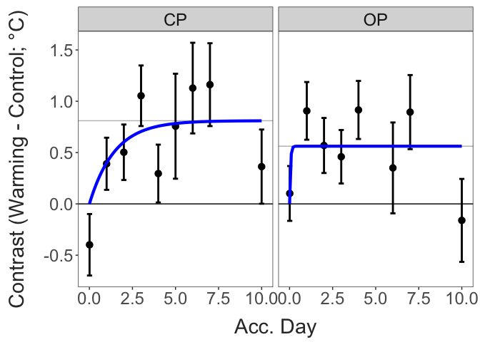

## Initial Conclusions {#initial-conclusions}
=======


## Initial Conclusions

The three variables of interest are: CTmax (across all control
replicates; tests for differences between populations); rate of
acclimation (the lambda value); magnitude of acclimation (ARR values
from the parameter estimates).

------------------------------------------------------------------------

## Preliminary Trials

The preliminary trials described below establish key elements of the
experimental design and protocol. Note: Trials are presented in a
logical, not chronological, order - Preliminary Trial B was performed
before Trial A.

### Before-and-After Acclimation

This trial examined the “maximum” amount of acclimation we can
reasonably expect to measure in a feasible amount of time. Experiment
duration is limited by factors like the generation time of copepods -
long experiments risk conflating individual age and acclimation effects.
Incubator temperatures were stable during this trial, tracked
continuously using a HOBO logger submerged in similar amounts of water
as used to maintain the copepods during acclimation.

``` r
acc_windows = ctmax_data %>% 
  group_by(exp_rep) %>% 
  summarise(start_time = min(datetime), 
            end_time = max(datetime)) %>% 
  filter(exp_rep == 0.5)

# To do: figure out a way to filter the data based on the acc_windows object; each exp_rep has a separate start and end time that should be used
inc_temps %>% 
  filter(datetime > acc_windows$start_time & datetime < acc_windows$end_time) %>%  
  group_by(incubator_temp) %>% 
  summarise(mean_temp = mean(temp_c), 
            temp_sd = sd(temp_c)) %>% 
  knitr::kable(digits = 2)
```

| incubator_temp | mean_temp | temp_sd |
|---------------:|----------:|--------:|
|             16 |     16.16 |    0.05 |
|             22 |     21.72 |    0.11 |

``` r

# Eventually will want to convert datetime into 'time since start' or something like that so all the reps can be overlaid
inc_temps %>% 
  filter(datetime > acc_windows$start_time & datetime < acc_windows$end_time) %>%  
  mutate(inc_id = paste(exp_rep, incubator_id, sep = "_")) %>% 
  ggplot(aes(x = datetime, y = temp_c, colour = factor(incubator_temp), group = inc_id)) + 
  geom_hline(yintercept = c(16,22)) + 
  geom_line(linewidth = 2) + 
  scale_colour_manual(values = c("royalblue", "brown2")) + 
  labs(y = "Temperature (°C)", 
       x = "Date", 
       colour = "Incubator \nTemp. (°C)") + 
  theme_bw(base_size = 25) + 
  theme(panel.grid = element_blank())
```


CTmax was measured before acclimation began and after 8 days of
acclimation. Here is a quick check to make sure there’s no systematic
differences between observers. Measurements for the four groups are
shown for each acclimation day. The different water baths (i.e. the
different observers) are shown in different colors.

``` r

ctmax_data %>%  
  filter(exp_rep == 0.5) %>% 
  mutate(water_bath = as.factor(water_bath), 
         acc_day = as.factor(acc_day)) %>% 
  ggplot(aes(x = acc_day, y = ctmax, colour = water_bath)) + 
  facet_wrap(pop~treatment) +
  geom_point() + 
  theme_matt_facets()
```

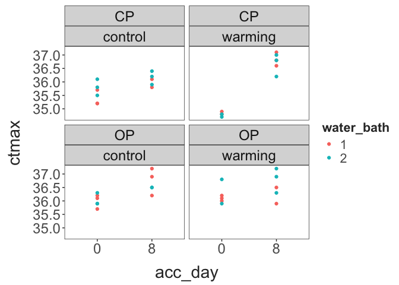

The change in CTmax over time for each of the four groups is shown
below. There was a general increase in CTmax over time (increases in the
control groups), but above this background change there was a pronounced
increase in the CTmax for the Centennial Park warming group.

``` r
ctmax_data %>%  
  filter(exp_rep == 0.5) %>% 
  group_by(pop, treatment, acc_day) %>% 
  summarise(mean_ctmax = mean(ctmax, na.rm = T), 
            ctmax_se = sd(ctmax) / sqrt(n())) %>% 
  ggplot(aes(x = acc_day, y = mean_ctmax, colour = treatment, group = treatment)) + 
  facet_wrap(pop~.) + 
  geom_point(size = 4) + 
  geom_line(linewidth = 2) + 
  geom_errorbar(aes(ymin = mean_ctmax - ctmax_se, 
                    ymax = mean_ctmax + ctmax_se), 
                linewidth = 2, width = 1) + 
  scale_colour_manual(values = c("royalblue", "brown2")) + 
  scale_x_continuous(breaks = c(0,8)) + 
  theme_matt()
```


### Daily Measurements

In the other preliminary trial, the temperatures were more variable.
Averages and standard deviations from the two incubators are shown in
this table. This may have due to fluctuations in ambient room
temperature and/or because temperature loggers were measuring air, and
not water, temperatures during this trial.

``` r
acc_windows = ctmax_data %>% 
  group_by(exp_rep) %>% 
  summarise(start_time = min(datetime), 
            end_time = max(datetime)) %>% 
  filter(exp_rep == 1)

# To do: figure out a way to filter the data based on the acc_windows object; each exp_rep has a separate start and end time that should be used
inc_temps %>% 
  filter(datetime > acc_windows$start_time & datetime < acc_windows$end_time) %>%  
  group_by(incubator_temp) %>% 
  summarise(mean_temp = mean(temp_c), 
            temp_sd = sd(temp_c)) %>% 
  knitr::kable(digits = 2)
```

| incubator_temp | mean_temp | temp_sd |
|---------------:|----------:|--------:|
|             16 |     15.28 |    0.39 |
|             22 |     22.42 |    0.68 |

While the average temperature was closer to the intended temperature in
the 22°C incubator, temperature was more variable than in the 16°C
incubator.

``` r

# Eventually will want to convert datetime into 'time since start' or something like that so all the reps can be overlaid
inc_temps %>% 
  filter(datetime > acc_windows$start_time & datetime < acc_windows$end_time) %>%  
  mutate(inc_id = paste(exp_rep, incubator_id, sep = "_")) %>% 
  ggplot(aes(x = datetime, y = temp_c, colour = factor(incubator_temp), group = inc_id)) + 
  geom_hline(yintercept = c(16,22)) + 
  geom_line(linewidth = 2) + 
  scale_colour_manual(values = c("royalblue", "brown2")) + 
  labs(y = "Temperature (°C)", 
       x = "Date", 
       colour = "Incubator \nTemp. (°C)") + 
  theme_bw(base_size = 25) + 
  theme(panel.grid = element_blank())
```


Thermal limit data is shown below. The larger points indicate the mean
for each treatment group on each acclimation day, with the raw data
shown as lighter points in the background. A general trend of increasing
thermal limits in the warming acclimation group is present, but there is
a fair amount of variation. That being said, it is too early to make any
conclusions about specific patterns.

``` r
ctmax_data %>% 
  filter(exp_rep == 1) %>% 
  group_by(pop, treatment, acc_hours) %>% 
  summarise(mean_ctmax = mean(ctmax)) %>% 
  ggplot(aes(x = acc_hours, y = mean_ctmax, colour = treatment)) + 
  facet_wrap(pop~.) + 
  geom_point(data = filter(ctmax_data, exp_rep == 1), aes(y = ctmax),
             alpha = 0.3) + 
  geom_point(size = 3) + 
  geom_line(linewidth = 1.5) + 
  scale_colour_manual(values = c("control" = "royalblue",
                                 "warming" = "brown2")) + 
  labs(x = "Acclimation Hour", 
       y = "CTmax (°C)") + 
  theme_matt_facets()
```


Shown below are the reaction norms for the two populations based on the
first and last measurements made (Day 6 in the daily measurements trial
and Day 8 in the before-and-after acclimation trial). Results are
similar for both populations, suggesting that an eight day period is
sufficient for the effects of acclimation to plateau.

``` r
ctmax_data %>%  
  group_by(exp_rep) %>% 
  filter(acc_hours == max(acc_hours)) %>% 
  group_by(exp_rep, pop, treatment, acc_hours) %>% 
  summarise(mean_ctmax = mean(ctmax, na.rm = T), 
            ctmax_se = sd(ctmax) / sqrt(n())) %>% 
  ggplot(aes(x = treatment, y = mean_ctmax, colour = pop, group = exp_rep)) + 
  facet_wrap(pop~.) + 
  geom_point(size = 4, 
             position = position_dodge(width = 0.5)) + 
  geom_line(linewidth = 2, 
            position = position_dodge(width = 0.5)) + 
  geom_errorbar(aes(ymin = mean_ctmax - ctmax_se, 
                    ymax = mean_ctmax + ctmax_se), 
                linewidth = 2, width = 0.2, 
                position = position_dodge(width = 0.5)) + 
  theme_matt()
```

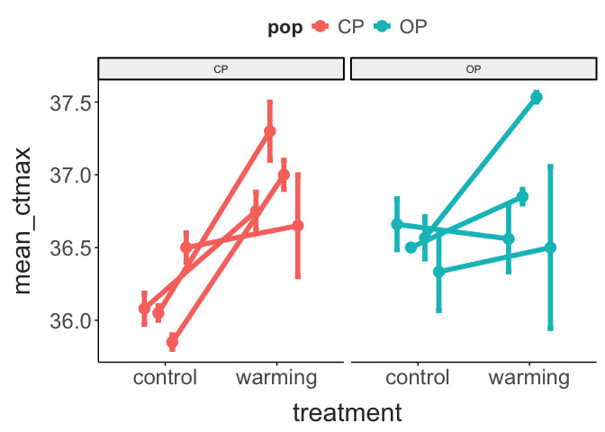
>>>>>>> 863ae6b67db4903a2abab75fdd535a07ae84f51b
