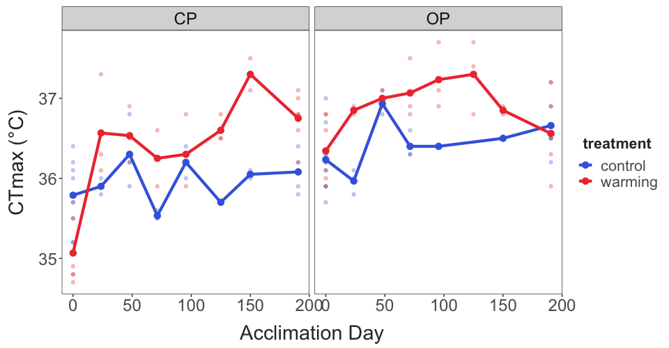

Rate of Acclimation in Skistodiaptomus pallidus
================
2026-03-08

- [Preliminary Trial A - Before-and-After
  Acclimation](#preliminary-trial-a---before-and-after-acclimation)
- [Preliminary Trial B - Daily
  Measurements](#preliminary-trial-b---daily-measurements)
- [Preliminary Take-Aways](#preliminary-take-aways)
- [Next Steps](#next-steps)

This project examines the rate and magnitude of acclimation in two
populations of *Skistodiaptomus pallidus*. The preliminary trials
described below establish key elements of the experimental design and
protocol. Note: Trials are presented in a logical, not chronological,
order - Preliminary Trial B was performed before Trial A.

## Preliminary Trial A - Before-and-After Acclimation

This trial examined the “maximum” amount of acclimation we can
reasonably expect to measure in a feasible amount of time. Experiment
duration is limited by factors like the generation time of copepods -
long experiments risk conflating individual age and acclimation effects.
Incubator temperatures were stable during this trial, tracked
continuously using a HOBO logger submerged in similar amounts of water
as used to maintain the copepods during acclimation.

``` r
acc_windows = ctmax_data %>% 
  group_by(exp_rep) %>% 
  summarise(start_time = min(datetime), 
            end_time = max(datetime)) %>% 
  filter(exp_rep == 0.5)

# To do: figure out a way to filter the data based on the acc_windows object; each exp_rep has a separate start and end time that should be used
inc_temps %>% 
  filter(datetime > acc_windows$start_time & datetime < acc_windows$end_time) %>%  
  group_by(incubator_temp) %>% 
  summarise(mean_temp = mean(temp_c), 
            temp_sd = sd(temp_c)) %>% 
  knitr::kable(digits = 2)
```

| incubator_temp | mean_temp | temp_sd |
|---------------:|----------:|--------:|
|             16 |     16.16 |    0.05 |
|             22 |     21.72 |    0.11 |

``` r

# Eventually will want to convert datetime into 'time since start' or something like that so all the reps can be overlaid
inc_temps %>% 
  filter(datetime > acc_windows$start_time & datetime < acc_windows$end_time) %>%  
  mutate(inc_id = paste(exp_rep, incubator_id, sep = "_")) %>% 
  ggplot(aes(x = datetime, y = temp_c, colour = factor(incubator_temp), group = inc_id)) + 
  geom_hline(yintercept = c(16,22)) + 
  geom_line(linewidth = 2) + 
  scale_colour_manual(values = c("royalblue", "brown2")) + 
  labs(y = "Temperature (°C)", 
       x = "Date", 
       colour = "Incubator \nTemp. (°C)") + 
  theme_bw(base_size = 25) + 
  theme(panel.grid = element_blank())
```


CTmax was measured before acclimation began and after 8 days of
acclimation. Here is a quick check to make sure there’s no systematic
differences between observers. Measurements for the four groups are
shown for each acclimation day. The different water baths (i.e. the
different observers) are shown in different colors.

``` r

ctmax_data %>%  
  filter(exp_rep == 0.5) %>% 
  mutate(water_bath = as.factor(water_bath), 
         acc_day = as.factor(acc_day)) %>% 
  ggplot(aes(x = acc_day, y = ctmax, colour = water_bath)) + 
  facet_wrap(pop~treatment) +
  geom_point() + 
  theme_matt_facets()
```


The change in CTmax over time for each of the four groups is shown
below. There was a general increase in CTmax over time (increases in the
control groups), but above this background change there was a pronounced
increase in the CTmax for the Centennial Park warming group.

``` r
ctmax_data %>%  
  filter(exp_rep == 0.5) %>% 
  group_by(pop, treatment, acc_day) %>% 
  summarise(mean_ctmax = mean(ctmax, na.rm = T), 
            ctmax_se = sd(ctmax) / sqrt(n())) %>% 
  ggplot(aes(x = acc_day, y = mean_ctmax, colour = treatment, group = treatment)) + 
  facet_wrap(pop~.) + 
  geom_point(size = 4) + 
  geom_line(linewidth = 2) + 
  geom_errorbar(aes(ymin = mean_ctmax - ctmax_se, 
                    ymax = mean_ctmax + ctmax_se), 
                linewidth = 2, width = 1) + 
  scale_colour_manual(values = c("royalblue", "brown2")) + 
  scale_x_continuous(breaks = c(0,8)) + 
  theme_matt()
```


## Preliminary Trial B - Daily Measurements

In the other preliminary trial, the temperatures were more variable.
Averages and standard deviations from the two incubators are shown in
this table. This may have due to fluctuations in ambient room
temperature and/or because temperature loggers were measuring air, and
not water, temperatures during this trial.

``` r
acc_windows = ctmax_data %>% 
  group_by(exp_rep) %>% 
  summarise(start_time = min(datetime), 
            end_time = max(datetime)) %>% 
  filter(exp_rep == 1)

# To do: figure out a way to filter the data based on the acc_windows object; each exp_rep has a separate start and end time that should be used
inc_temps %>% 
  filter(datetime > acc_windows$start_time & datetime < acc_windows$end_time) %>%  
  group_by(incubator_temp) %>% 
  summarise(mean_temp = mean(temp_c), 
            temp_sd = sd(temp_c)) %>% 
  knitr::kable(digits = 2)
```

| incubator_temp | mean_temp | temp_sd |
|---------------:|----------:|--------:|
|             16 |     15.28 |    0.39 |
|             22 |     22.42 |    0.68 |

While the average temperature was closer to the intended temperature in
the 22°C incubator, temperature was more variable than in the 16°C
incubator.

``` r

# Eventually will want to convert datetime into 'time since start' or something like that so all the reps can be overlaid
inc_temps %>% 
  filter(datetime > acc_windows$start_time & datetime < acc_windows$end_time) %>%  
  mutate(inc_id = paste(exp_rep, incubator_id, sep = "_")) %>% 
  ggplot(aes(x = datetime, y = temp_c, colour = factor(incubator_temp), group = inc_id)) + 
  geom_hline(yintercept = c(16,22)) + 
  geom_line(linewidth = 2) + 
  scale_colour_manual(values = c("royalblue", "brown2")) + 
  labs(y = "Temperature (°C)", 
       x = "Date", 
       colour = "Incubator \nTemp. (°C)") + 
  theme_bw(base_size = 25) + 
  theme(panel.grid = element_blank())
```


Thermal limit data is shown below. The larger points indicate the mean
for each treatment group on each acclimation day, with the raw data
shown as lighter points in the background. A general trend of increasing
thermal limits in the warming acclimation group is present, but there is
a fair amount of variation. That being said, it is too early to make any
conclusions about specific patterns.

``` r
ctmax_data %>% 
  filter(exp_rep == 1) %>% 
  group_by(pop, treatment, acc_hours) %>% 
  summarise(mean_ctmax = mean(ctmax)) %>% 
ggplot(aes(x = acc_hours, y = mean_ctmax, colour = treatment)) + 
  facet_wrap(pop~.) + 
  geom_point(data = filter(ctmax_data, exp_rep == 1), aes(y = ctmax),
             alpha = 0.3) + 
  geom_point(size = 3) + 
  geom_line(linewidth = 1.5) + 
  scale_colour_manual(values = c("control" = "royalblue",
                                 "warming" = "brown2")) + 
  labs(x = "Acclimation Hour", 
       y = "CTmax (°C)") + 
  theme_matt_facets()
```


## Preliminary Take-Aways

These two trials measured CTmax at different intervals, but used a
similar experimental set-up. One of the main goals for these trials was
to determine the appropriate experimental duration in order to determine
both rate and magnitude of acclimation.

Shown below are the reaction norms for the two populations based on the
first and last measurements made (Day 6 in the daily measurements trial
and Day 8 in the before-and-after acclimation trial). Results are
similar for both populations, suggesting that an eight day period is
sufficient for the effects of acclimation to plateau.

``` r
ctmax_data %>%  
  group_by(exp_rep) %>% 
  filter(acc_hours == max(acc_hours)) %>% 
  group_by(exp_rep, pop, treatment, acc_hours) %>% 
  summarise(mean_ctmax = mean(ctmax, na.rm = T), 
            ctmax_se = sd(ctmax) / sqrt(n())) %>% 
  ggplot(aes(x = treatment, y = mean_ctmax, colour = pop, group = exp_rep)) + 
  facet_wrap(pop~.) + 
  geom_point(size = 4, 
             position = position_dodge(width = 0.5)) + 
  geom_line(linewidth = 2, 
             position = position_dodge(width = 0.5)) + 
  geom_errorbar(aes(ymin = mean_ctmax - ctmax_se, 
                    ymax = mean_ctmax + ctmax_se), 
                linewidth = 2, width = 0.2, 
             position = position_dodge(width = 0.5)) + 
  theme_matt()
```


All experimental data is shown below. This representation highlights the
variability in the control treatments, which needs to be accounted for.
One thing to note: CP warming individuals had lower CTmax values than
the control individuals in both preliminary trials. This is something to
watch in the future, to ensure no confounding factors are affecting the
results.

``` r
ctmax_data %>% 
  group_by(pop, treatment, acc_hours) %>% 
  summarise(mean_ctmax = mean(ctmax)) %>% 
ggplot(aes(x = acc_hours, y = mean_ctmax, colour = treatment)) + 
  facet_wrap(pop~.) + 
  geom_point(data = ctmax_data, aes(y = ctmax),
             alpha = 0.3) + 
  geom_point(size = 3) + 
  geom_line(linewidth = 1.5) + 
  scale_colour_manual(values = c("control" = "royalblue",
                                 "warming" = "brown2")) + 
  labs(x = "Acclimation Day", 
       y = "CTmax (°C)") + 
  theme_matt_facets()
```



We will be using a linear model to analyze the data, and to examine
specific patterns in the changes in thermal limits over time. For now,
we use a simple linear regression model: CTmax as a function of
treatment, population, and acclimation day (with all possible
interactions). This model is limited by the small sample size, but
performs reasonably well.

``` r
# this is an initial version of the model; later versions will include experimental replicate and incubator as random effects

model_data = ctmax_data %>% 
  mutate(acc_hours = as.factor(acc_hours))

prelim.model = lm(ctmax ~ acc_hours * treatment * pop, data = model_data)

#performance::check_model(prelim.model)
```

The model indicates a significant effect of all individual factors,
along with a significant interaction between 1) acclimation time and
treatment, 2) acclimation time and population, and 3) the full three-way
interaction (as would be expected if populations differ in their
acclimation capacities).

``` r
car::Anova(prelim.model) 
## Anova Table (Type II tests)
## 
## Response: ctmax
##                          Sum Sq Df F value    Pr(>F)    
## acc_hours                9.8598  7 10.3521 4.088e-09 ***
## treatment                1.7973  1 13.2094 0.0004972 ***
## pop                      7.1966  1 52.8913 2.376e-10 ***
## acc_hours:treatment      4.4276  7  4.6487 0.0002167 ***
## acc_hours:pop            2.4833  7  2.6073 0.0179780 *  
## treatment:pop            0.0327  1  0.2403 0.6253663    
## acc_hours:treatment:pop  2.7463  6  3.3640 0.0053105 ** 
## Residuals               10.6130 78                      
## ---
## Signif. codes:  0 '***' 0.001 '**' 0.01 '*' 0.05 '.' 0.1 ' ' 1
```

We’ll calculate estimated marginal means for each treatment group on
each acclimation day. These marginal means can then be used to calculate
pairwise contrasts between the control and warming groups (CTmax in the
22°C group - CTmax in the 16°C group). A positive contrast indicates an
increase in CTmax in the warming group relative to the control group
(i.e. an increase in thermal limits after acclimation to higher
temperatures).

These contrasts will be the basis for estimating the rate and magnitude
of acclimation capacities. Below is a rough approximate of what that
might look like, with a logarithmic relationship shown between the
effect of acclimation and the acclimation duration.

``` r
contrasts = emmeans::emmeans(prelim.model, ~ treatment | pop * acc_hours) %>% 
  emmeans::contrast("revpairwise") %>% as_tibble() %>% 
  mutate(acc_hours = as.numeric(as.character(acc_hours)))

contrasts %>% 
  mutate(acc_hours = if_else(acc_hours == 0, 0.01, acc_hours)) %>% 
ggplot(aes(x = acc_hours, y = estimate)) + 
  facet_wrap(pop~.) + 
  geom_hline(yintercept = 0) +
  geom_errorbar(aes(ymin = estimate - SE, ymax = estimate + SE), 
                linewidth = 1, width = 0.3) + 
  geom_point(size = 3) + 
  geom_smooth(method = "lm", formula = y ~ log(x)) + 
  labs(x = "Acc. Hour", 
       y = "Contrast (Warming - Control; °C)") + 
  theme_matt_facets()
```


In order to actually estimate the parameters, we’ll have to use a more
complex computational approach. Burton and Einum (2025) describe an
approach for measuring both rate of acclimation and acclimation capacity
from a time series of CTmax values.

Their approach relies on fitting the following model to the data: Zt =
Za \* (1-e^(−λt))

In this model, Zt is the effect of acclimation at time t. Za is the
fully acclimated CTmax value (this is the magnitude of acclimation
parameter). The parameter λ is the rate of acclimation. In the Burton
and Einum study, data sets had to be transformed such that measurements
at the different time points were all relative to the first CTmax
measurements (e.g. all time series start at zero and measure the change
relative to the start point).

Our analysis standardizes data not based on the initial CTmax value, but
rather based on the corresponding control values from each assay. For
our analyses, we will fit the model to the estimated contrasts from each
day.

The parameter estimates from the preliminary model are shown below.
Note: the estimate of lambda for the OP population is unrealistic, and
likely reflects the limited sample size and general variability in the
data.

``` r
# Zt = Za * (1-e^(−λt))
# Za is the rescaled asymptotic critical temperature when acclimation is complete (i.e., plasticity capacity)
# λ is the plasticity rate (per hour)

param_data = contrasts %>%
  group_by(pop) %>% 
  arrange(acc_hours) %>% 
  mutate(acc_hours = if_else(acc_hours == 0, 0.01, acc_hours)) 

acc_params = data.frame()

for (i in 1:length(unique(param_data$pop))){
  
  pop_data = filter(param_data, pop == unique(param_data$pop)[i]) %>% 
    drop_na() 
  
  mod1 = try(nls_multstart(estimate ~ z_asymp*(1-exp(-lambda*acc_hours)),
                            data = pop_data,
                            iter = 1000,
                            start_lower = c(z_asymp=0.01, lambda=0),
                            start_upper = c(z_asymp = 10, lambda=1),
                            lower = c(z_asymp = 0, lambda=0),
                            supp_errors = 'Y',
                            convergence_count = FALSE,
                            na.action = na.omit), silent =TRUE)
  
  pop_params = data.frame(
    z_asymp = summary(mod1)$coefficients[1,1],
    z_asymp_var = vcov(mod1)[1,1],
    lambda = summary(mod1)$coefficients[2,1],
    lambda.var = vcov(mod1)[2,2],
    pop = pop_data$pop[1],
    num_contrasts = length(pop_data$estimate)) %>% 
    mutate(arr = z_asymp / (22-16))
  
  acc_params = bind_rows(acc_params, pop_params)

  }

acc_params %>% 
  select(pop, n = num_contrasts, z_asymp, arr, lambda) %>% 
  knitr::kable()
```

| pop |   n |   z_asymp |       arr |     lambda |
|:----|----:|----------:|----------:|-----------:|
| CP  |   8 | 0.9634085 | 0.1605681 |  0.0124842 |
| OP  |   7 | 0.4500000 | 0.0750000 | 27.8902384 |

The plot here shows the estimated contrasts on each day. The model fit
is included for both populations (in blue), along with the estimated
final magnitude of acclimation (grey horizontal line).

``` r
cp_params = filter(acc_params, pop == "CP")
op_params = filter(acc_params, pop == "OP")

# Create a new data frame with predicted values
acc_hours <- seq(0, max(param_data$acc_hours), length.out = 100)
cp_pred <- cp_params$z_asymp*(1-exp(-cp_params$lambda*acc_hours))
op_pred <- op_params$z_asymp*(1-exp(-op_params$lambda*acc_hours))

predictions = data.frame(acc_hours, 
                         cp_pred, 
                         op_pred) %>% 
  pivot_longer(cols = c(cp_pred:op_pred), 
               names_to = c("pop", NA), 
               names_sep = "_", 
               values_to = "pred") %>% 
  mutate(pop = toupper(pop))

param_data %>% 
ggplot(aes(x = acc_hours, y = estimate)) + 
  facet_wrap(pop~.) + 
  geom_hline(yintercept = 0) +
  geom_hline(data = acc_params, aes(yintercept = z_asymp),
             colour = "grey") + 
  geom_errorbar(aes(ymin = estimate - SE, ymax = estimate + SE), 
                linewidth = 1, width = 0.3) + 
  geom_point(size = 3) + 
  geom_line(data = predictions, aes(x = acc_hours, y = pred),
            colour = "blue",
            linewidth=1.5)+
  labs(x = "Acc. Day", 
       y = "Contrast (Warming - Control; °C)") + 
  theme_matt_facets()
```


## Next Steps

The preliminary data is encouraging - acclimation rate dynamics are
uncertain, but the estimates of the magnitude of acclimation seem to
converge within eight days of exposure to warming. The illustrative
example from the Burton and Einum 2025 paper indicates an acclimation
duration of ~10 days. Experimental replicates for this project should
aim for that same duration, with CTmax assays on Day 0, 1, 2, 3, \[4\],
\[5\], 6, 8, and 10. Experiments would take just under two weeks to
complete: set up on Monday, with the Day 0 CTmax assay on Tuesday; days
4 and 5 fall on the weekend; day 10 falls on Friday of the second week.
